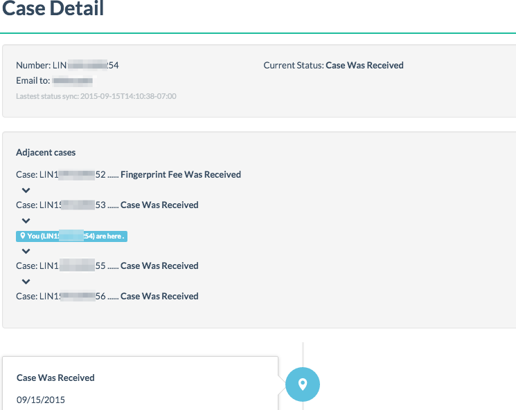

# USCIS case tracking
(a Google App Engine application)

Existing running service: <http://case-monitoring.appspot.com/>

# Support new version USCIS website (Nov 2014)

## Summary
The application will check your USCIS case and **adjacent cases** every 30 mins. And send you notification by email if status changes.

## Contributors
* FAN FEI, feifan.pub@gmail.com
* NEIL CHEN, neil.chen.nj@gmail.com

## Customization
### Modify check interval
modify `schedule` configuration in `cron.yaml` 

